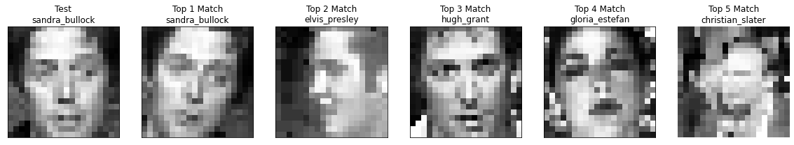
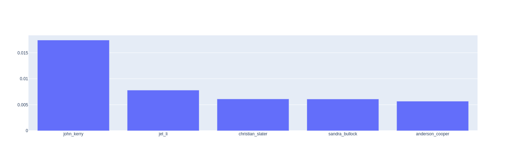

# Face Recognition Using Subspace Methods

> **An example of predicted matches found by the algorithm**  
<br />  

  
<br />  

> **Similarity scores of the matches**  
  

> Accuracy of the implemented methods  

| Method | Top 1 accuracy | Top 5 accuracy |
| :--- | :---: | :---: |
| MSM (baseline) | **91.48** | **93.61** |
| KMSM | 80.85 | 91.48 |
| Hybrid | 91.48 | 93.61 |  


## Overview
Subspace based methods are implemented and evaulated using the [YTC](http://seqamlab.com/youtube-celebrities-face-tracking-and-recognition-dataset/) dataset.  
1. Mutual Subspace Method  
2. Kernel Mutual Subspace Method  
3. Kernel Mutual Subspace Method + Constrained Mutual Subspace Method  

## Requirement
[CuPy](https://github.com/cupy/cupy) is used for linalg operataions.
```
conda create -n facerecog python=3.7
conda activate facrerecog
conda install cupy ConfigArgParse matplotlib
```  
## Usage
To run tests using configurations specified in config file  
```
python run.py -c config/exp.conf
```

## Features
TODO

## Reference
1. [部分空間法の面白さに魅せられて, 福井 和広](http://www.cvlab.cs.tsukuba.ac.jp/~kfukui/papers/FellowLecture0321.pdf)  
2. [制約相互部分空間法と直交相互部分空間法の比較, 福井 和広 山口 修](http://www.cvlab.cs.tsukuba.ac.jp/~kfukui/papers/subspace2006-fukui.pdf)
3. [LECTURE: KERNEL PCA, Rita Osadchy](http://www.cs.haifa.ac.il/~rita/uml_course/lectures/KPCA.pdf)

## Author
Pragyan Shrestha  
University of Tsukuba, Empowerment Informatics 1st Year  


